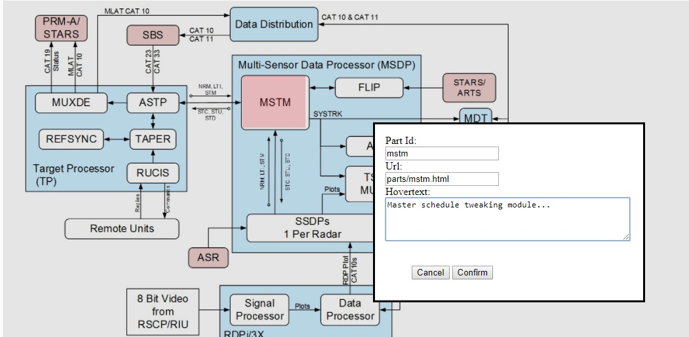
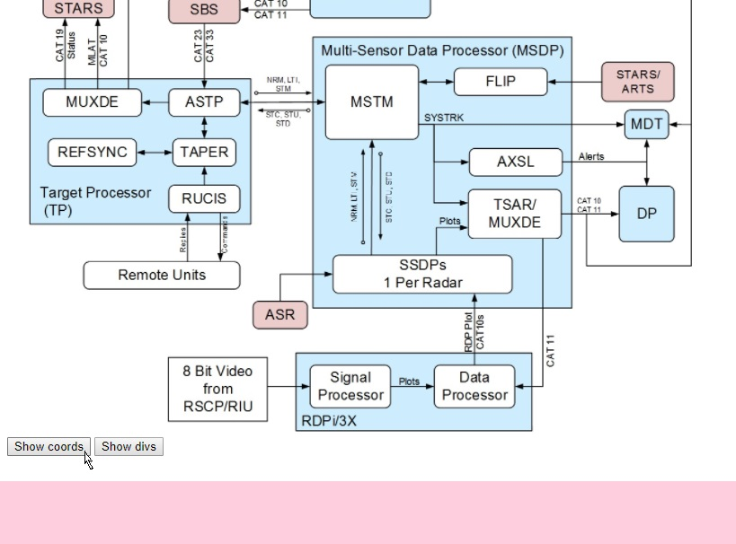
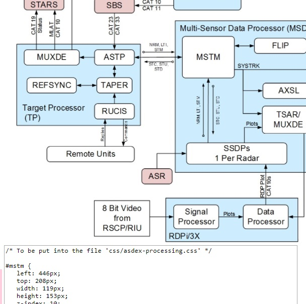
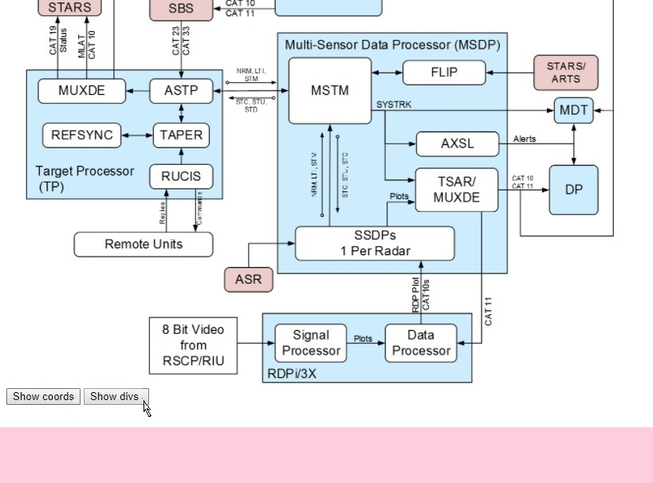
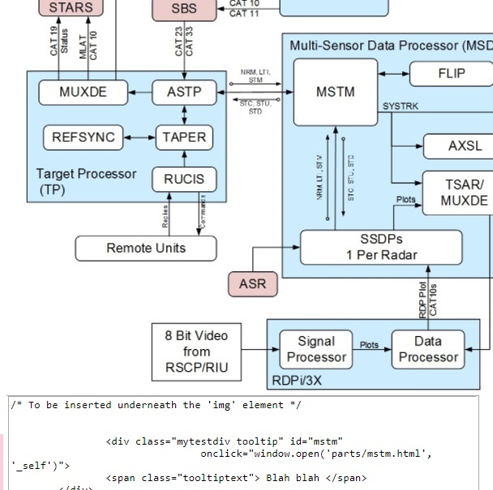
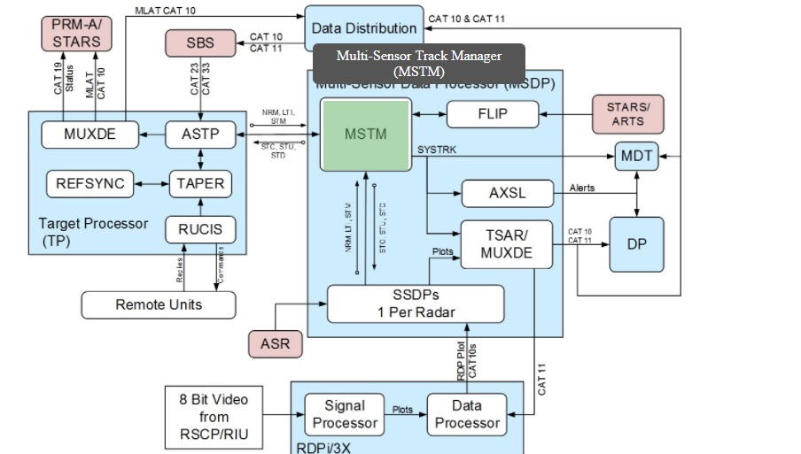

# HTML Documenter
This is a collection of utilities to help in creating stand-alone HTML documentation for a complex system.

## IMAGE MAP HELPER
Image Map Helper helps the user to create an image map, where an image, such as a diagram showing the parts of
a complex system, or the regions of a country, etc. serve as an index into html pages for each part or region.

There are two parts, which are both written in Javascript.

### map_helper.js

This is javascript code for setting an image map. The way that it works is that you create an HTML page with your 
image in it, by replacing the URL in a provided template ("helper-template.html"). Replace "../images/<image-name>.jpg" by 
the path to your image. Replace "<image-title>" by the title of your image. Replace "<alt-text>" by the alt text
for your image. You can also replace the width argument. You also may need to adjust the paths to the css files and javascript files.

After setting up the helper file, open it in a browser (currently, it's only been tested in Chrome and Internet
Explorer; it may not work in Firefox or Safari). To specify a part or region, click the mouse on the upper left-hand corner
of the region (currently, only rectangular regions are supported.) Then click again on the lower right-hand corner of
the region. A transparent red region will appear showing the region selected. Also, a form will pop up that will
allow you to specify the following attributes for your part or region:

1. The id for the part or region.
2. A URL for a page with more information about that part or region.
3. Hovertext, which is typically a one-sentence blurb about the region that will appear when your mouse hovers over the region.

**Mark a region using the mouse pointer**

The region turns reddish to indicate the region marked. Fill in the details for the region, including ID, url and hovertext.

**After marking all the regions, click "Show Coords" to generate CSS.**

**The generated CSS is shown in a text area**

**Click "Show divs" to generate HTML.**

**The generated HTML is shown in a text area**

After giving information about all the regions in your image map, you are ready to generate the code. There are
two pieces of code that are generated:

#### CSS that gives the coordinates for each part or region.
To see this CSS, click on the button called "Show Coords". The generated css wil appear in a text region.
Copy this css and place into a file called something like "<image-name>.css". Place it into the css directory.

#### HTML that creates divs for each region.
To see this HTML. click on the button called "Show Divs". The html will appear in a text region. Copy this and
put it into the html file for your image (created using the template image-map-template.html). Place the html
directly underneath the "img" element, inside the parent div (called "parent").

### image_map.js

This is javascript code that implements the image map. 

Create your image map file by copying and modifying "image-map-template.html". Perform the same replacements as
for customizing "helper-template.html". Then add the html generated by the map helper.

Afterwards, if you load the image map in a browser, then when you hover over a part or region, the hover text appears,
and the region is highlighted. Clicking on the region will open the html file giving more information about that region.

**Hovering over a marked region makes the region turn greenish**

Hovertext is displayed, and clicking on the region will take you to the web page specified by the URL given previously.
 
Sample examples of the helper file, image map and css files are included in the html directory. They are called:
asde-x-overview.html, asde-x-overview_helper.html and asdex-processing (in the css directory).

# INSTALLATION AND CONFIGURATION

To create a new html documentation project

1. Copy the directory "project-template" and rename it to the name of your project.
2. For each image that you would like to turn into an image-map, place the image
file (for example, "my-image.jpg") into the "images" directory.
3. For each image, copy and rename "helper-template.html" and "image-map-template.html"
and place into the "html" directory.
4. Modify the template files as described above, to replace the placeholders 
"<image-name>.jpg", "<image-title>", and "<alt-text>" to match the name and title
of your image.
5. Now you are ready to create your image map.